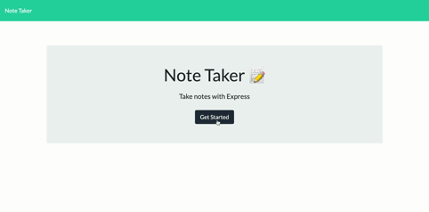

# Note-Taker | 

## Description

This is my first live page that has been deployed with *Heroku*. I have learned to create a local server and work with testing code before going fully live. I like that there are many steps that you can take to make sure that your application is working properly. Some challenges I faced with this note taker was understanding of telling the computer to read and write files when necessary. With many cases involving plenty of trial and error, I finally came across a solution.

This has definitely sparked my interest to dive more into databases and servers. This skill will be crucial to becoming a truly full stack Web Developer. 

## Table of Contents

* [Usage](#usage)
* [Credits](#credits)
* [License](#license)

## Usage

*Below is a GIF demonstrating the usage of the application*

*Below is a link to the deployed application.*

https://whispering-lake-76158.herokuapp.com/

## Credits

Instruction led by Dave Leonhardt and Vincent Gubitosi

## License

This repo is under the MIT License

## Questions

If you have any questions please email me at jameslamb13@gmail.com. My link to GitHub is https://github.com/Lambaa94

